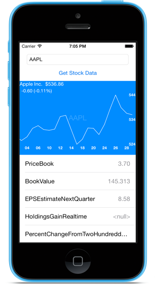

# MAStockGraph

`MAStockGraph` is a library that allows you to easily pull a broad range of <a href="http://finance.yahoo.com">Yahoo! Finance</a> stock market data for a company and chart the price for varying time frames. 

## Requirements

`MAStockGraph ` uses ARC and requires iOS 7.0+.

## Installation

Copy the folder `MAStockGraph` to your project. 
CocoaPods will supported on a later version.

## Usage

Company data can be queried through `findStockDataWithBlock:(MAFinanceResultBlock)block` Prior to calling the block you have to set both `symbol` and `period` so the class `MAFinance` knows what data to fetch. Using one drop-in block allows for simplicity and portability. 

`MAStockGraph` is a very portable subclass of UIView that charts a stock based on prices `pricesArray` and dates `datesArray`. Set those and the graph with handle the rest. 

Current version returns the following data set 

    Prices for our time frame
    PriceBook,
    BookValue,
    EPSEstimateNextQuarter,
    HoldingsGainRealtime,
    PercentChangeFromTwoHundreddayMovingAverage,
    EPSEstimateCurrentYear,
    EBITDA,
    PercentChangeFromFiftydayMovingAverage,
    PERatioRealtime,
    Name,
    ChangeRealtime,
    HoldingsGain,
    PEGRatio,
    DaysRange,
    Ask,
    Bid,
    MarketCapRealtime,
    BidRealtime,
    ErrorIndicationreturnedforsymbolchangedinvalid,
    LastTradePriceOnly,
    PriceSales,
    PercentChangeFromYearLow,
    HoldingsValue,
    EPSEstimateNextYear,
    MarketCapitalization,
    AfterHoursChangeRealtime,
    PricePaid,
    ChangeFromYearLow,
    PERatio,
    LastTradeTime,
    HoldingsValueRealtime,
    MoreInfo,
    FiftydayMovingAverage,
    ChangeFromTwoHundreddayMovingAverage,
    Volume,
    ChangePercentRealtime,
    ChangeFromFiftydayMovingAverage,
    TickerTrend,
    StockExchange,
    Notes,
    LastTradeDate,
    TwoHundreddayMovingAverage,
    AnnualizedGain,
    DividendPayDate,
    ChangeinPercent,
    DividendYield,
    HoldingsGainPercent,
    Change,
    YearHigh,
    PriceEPSEstimateNextYear,
    DaysValueChangeRealtime,
    ChangeFromYearHigh,
    OrderBookRealtime,
    Symbol,
    DaysValueChange,
    PriceEPSEstimateCurrentYear,
    PercentChange,
    DaysHigh,
    LastTradeRealtimeWithTime,
    LastTradeWithTime,
    Open,
    HighLimit,
    PreviousClose,
    AverageDailyVolume,
    DaysLow,
    YearRange,
    HoldingsGainPercentRealtime,
    symbol,
    ShortRatio,
    DaysRangeRealtime,
    LowLimit,
    SharesOwned,
    ExDividendDate,
    "Change_PercentChange",
    DividendShare,
    AskRealtime,
    EarningsShare,
    PercebtChangeFromYearHigh,
    OneyrTargetPrice,
    YearLow,
    Commission,
    TradeDate

## Customization

`MAStockGraph` is very customizable. The `MAFinance` class handles all the Yahoo! Finance interactions and `MAStockGraph` handles all the charting. 

### Customizing Stock Graph

`MAStockGraph` allows for setting of

- Top Color
- Bottom Color
- Background Color
- Line Color
- Text Color
- Axes Label Color
- Line Width
- Toggle Touch Enabled

## License

    The MIT License (MIT)

    Copyright (c) 2014 Michael Ackley 

    Permission is hereby granted, free of charge, to any person obtaining a copy
    of this software and associated documentation files (the "Software"), to deal
    in the Software without restriction, including without limitation the rights
    to use, copy, modify, merge, publish, distribute, sublicense, and/or sell
    copies of the Software, and to permit persons to whom the Software is
    furnished to do so, subject to the following conditions:

    The above copyright notice and this permission notice shall be included in
    all copies or substantial portions of the Software.

    THE SOFTWARE IS PROVIDED "AS IS", WITHOUT WARRANTY OF ANY KIND, EXPRESS OR
    IMPLIED, INCLUDING BUT NOT LIMITED TO THE WARRANTIES OF MERCHANTABILITY,
    FITNESS FOR A PARTICULAR PURPOSE AND NONINFRINGEMENT. IN NO EVENT SHALL THE
    AUTHORS OR COPYRIGHT HOLDERS BE LIABLE FOR ANY CLAIM, DAMAGES OR OTHER
    LIABILITY, WHETHER IN AN ACTION OF CONTRACT, TORT OR OTHERWISE, ARISING FROM,
    OUT OF OR IN CONNECTION WITH THE SOFTWARE OR THE USE OR OTHER DEALINGS IN
    THE SOFTWARE.
